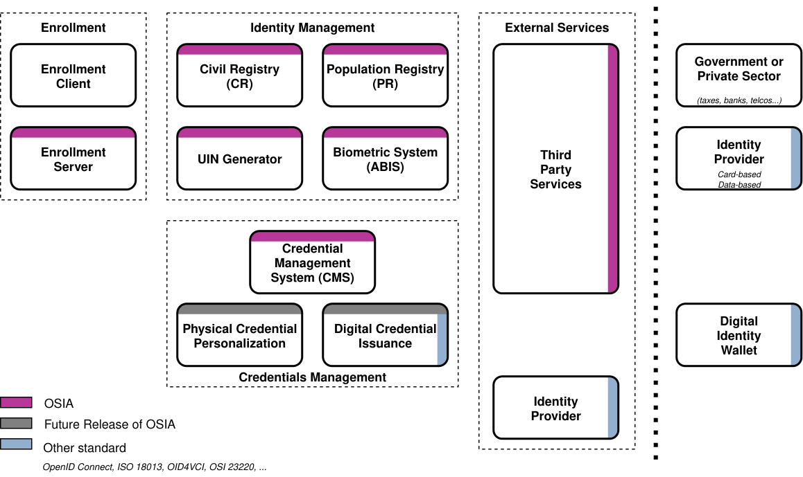

.. _chapter2:

Figures, tables and diagrams
============================

This chapter demonstrates the visual elements you will use most in a
specification: images, tables in two different styles, and diagrams generated
from text. As before, read the rendered page, then open ``chapter2.rst`` to see
the markup.

Figures
-------

A *figure* is an image with a caption. Put your image file in the top-level
``images/`` folder and reference it with a relative path. The ``:width:`` option
scales it to a share of the page width.

    A figure caption appears below the image and is numbered automatically.

Use a single raster image (PNG) so the same file works in both the web pages and
the PDF. Vector formats (SVG) look sharper on screen but need a separate PDF
copy, so PNG keeps the template simple.

Tables
------

Two table styles are available; pick whichever is easier for the content.

A **list-table** is the easiest to edit: every cell is a bullet, so you never
have to align columns by hand. Add or remove rows freely.

.. list-table:: A simple list-table
    :header-rows: 1
    :widths: 30 70

    * - Field
      - Description
    * - id
      - The unique identifier.
    * - name
      - A human-readable name.

A **grid-style table** can group rows under spanning headers, which is useful
for mapping matrices. Its one rule: the cell text MUST line up under the ``=``
and ``-`` border characters, or the build fails with "Malformed table". Edit it
carefully, keeping each column within its width.

.. table:: A grouped table
    :class: longtable

    =================================  ============  ============  ============
    **Rows**                           Column A      Column B      Column C
    =================================  ============  ============  ============
    **Group One**
    ---------------------------------------------------------------------------
    Item One                           X             X
    Item Two                           X             X             X
    ---------------------------------  ------------  ------------  ------------
    **Group Two**
    ---------------------------------------------------------------------------
    Item Three                         X                           X
    =================================  ============  ============  ============

Diagrams
--------

Diagrams are written as *text* and rendered to images at build time using
PlantUML — so they stay editable, version-controlled, and consistent in style.
This is a sequence diagram describing an interaction between three parties:

.. uml::
    :caption: A sequence diagram, written as text
    :scale: 50%

    hide footbox
    actor "Actor" as actor
    participant "Service A" as A
    participant "Service B" as B

    actor -> A: request()
    activate A
    A -> B: lookup(data)
    B -->> A: result
    A -->> actor: response
    deactivate A

The same ``.. uml::`` block draws many other diagram types. A *class diagram*,
for example, is a convenient way to document a data model — the entities, their
fields, and the relationships between them:

.. uml::
    :caption: A class diagram describing a data model
    :scale: 50%

    class EntityA {
        string identifier;
    }

    class EntityB {
        string field1;
        date field2;
        ...
    }
    EntityA o- EntityB

    class EntityC {
        string field1;
        int field2;
        date field3;
        ...
    }
    EntityC -o EntityA

    class EntityD {
        byte[] data;
        URL reference;
    }
    EntityA o-- "*" EntityD

PlantUML can also draw use-case diagrams, activity diagrams, state machines and
more — see https://plantuml.com for the full syntax.

.. note::

    Diagrams require PlantUML to be available at build time. The online build
    (GitHub Pages) installs it automatically; for local builds see the project
    HOWTO.
